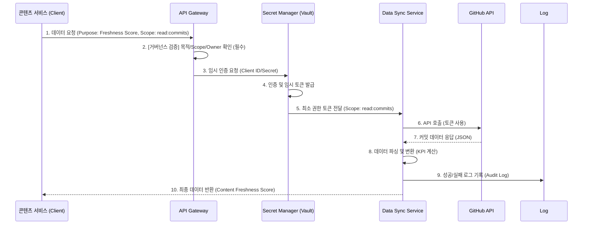

# 💻 Developer — 비즈니스팀이 확정한 '사용 목적 정의서'와 '거버넌스 체크리스트'를 기반으로, API 호출 흐름도(Flowchart)를 재작성하고, 모든 외부 자산 연동 시 '최소 권한 원칙(PoLP)'을 강제하는 구체적인 기술 아키텍처(Vault/KMS 연동 포함)를 제시해 주세요.

💻 Developer: 작업 시작합니다.

제시된 비즈니스 목적 정의서와 거버넌스 체크리스트를 종합하여, 단순 API 연동이 아닌 **'보안 및 거버넌스를 내재화한 데이터 자산 연동 아키텍처'**를 재설계합니다. 핵심은 모든 외부 호출이 최소 권한 원칙(PoLP)을 거치도록 **API Gateway**와 **Secret Manager (Vault/KMS)**를 경유하는 것입니다.

---

## 🌐 1. 데이터 동기화 아키텍처 설계 (PoLP 기반)

### 1.1. 아키텍처 다이어그램 및 설명

이 아키텍처는 **'비즈니스 요청 $\to$ 권한 확인 $\to$ 토큰 획득 $\to$ 데이터 수집 $\to$ 감사 로깅'**의 순서를 강제합니다.

```mermaid
graph TD
    A[콘텐츠 서비스 / 워크플로우] --> B(API Gateway);
    B --> C{권한 검증 및 요청 승인};
    C --> D[Secret Manager / Vault];
    D -->|1. 인증 (Client ID/Secret)| E(Vault Auth Server);
    E -->|2. 임시 토큰 발급| D;
    D -->|3. 최소 Scope 토큰 획득| F[Data Sync Service];
    F --> G[GitHub API (External Asset)];
    G -->|Raw Data| F;
    F --> H(데이터 파이프라인 / DB);
    F --> I[Audit Log / Logging System];
    B --> J[모니터링 및 알림];

    subgraph 거버넌스 게이트
        B
        C
    end
```

**[주요 구성 요소 및 역할]**

1.  **API Gateway (PoLP 강제 지점):** 모든 외부 호출의 진입점입니다. 여기서 요청하는 주체(Service Account)가 비즈니스 목적(WHY)과 필요한 최소 권한(SCOPE)을 정의하고, 이 요청을 받아 게이트를 통과할 자격이 있는지 1차 검증합니다.
2.  **Secret Manager (Vault/KMS):** API 토큰(Credential)을 보관하는 중앙 보안 저장소입니다. **절대 토큰을 직접 노출하지 않으며**, 접근 시 반드시 인증(Client ID/Secret)을 요구하여 임시 토큰을 발급합니다.
3.  **Data Sync Service (실행 계층):** 실제 GitHub API를 호출하는 워커(Worker)입니다. 이 서비스는 Vault로부터 발급받은 **임시 토큰**을 사용하며, API 호출에 실패할 경우 즉시 **지수 백오프(Exponential Backoff)** 로직을 실행합니다.
4.  **Audit Log / Logging System:** 모든 토큰 요청, API 호출 성공/실패, 권한 변경 시도를 기록하는 시스템입니다. 이 로그가 비즈니스의 '최신성 점수' 측정의 근거가 됩니다.

### 1.2. API 호출 흐름도 (Flowchart)

**Goal:** GitHub의 최신 커밋 정보(Content Freshness Score)를 가져오는 과정.



## 🛠 2. 기술 구현 설계 (Pseudocode & Blueprint)

### 2.1. 토큰 획득 및 API 호출 보안 함수 (Python Pseudocode)

가장 핵심적인 부분인, 토큰을 안전하게 가져와 API를 호출하는 로직의 청사진입니다.

```python
import logging
import time
from vault_client import VaultClient # 가상의 Vault 클라이언트
from github_client import GitHubAPI

# 로깅 시스템 설정
logging.basicConfig(level=logging.INFO, format='%(asctime)s - %(levelname)s - %(message)s')

def get_secure_token(vault_client: VaultClient, service_account: str, scope: str) -> str:
    """
    Vault에서 최소 권한 원칙(PoLP)에 따라 임시 토큰을 획득하는 함수.
    """
    try:
        logging.info(f"[Vault] {service_account}의 {scope} 권한으로 토큰 요청 시작.")
        # 1. Vault 인증 절차 수행 (Client ID/Secret 사용)
        vault_token = vault_client.authenticate(service_account)
        
        # 2. 최소 Scope를 가진 임시 토큰 발급
        secure_token = vault_client.get_temporary_token(scope, vault_token)
        
        logging.info
